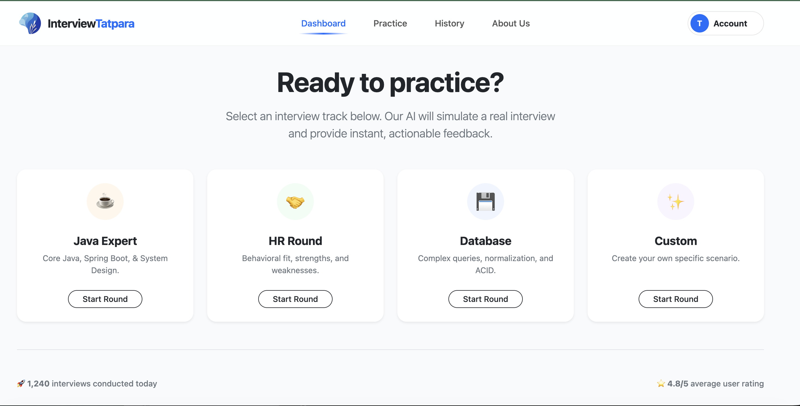
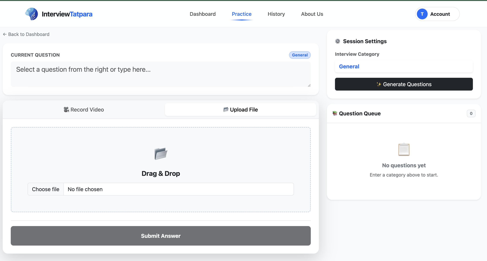
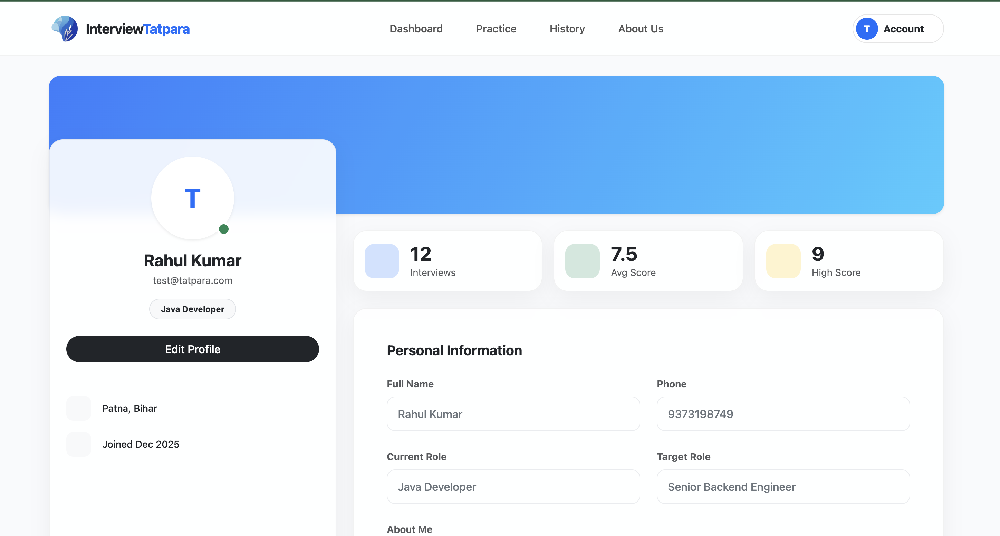

# InterviewTatpara
#  Interview.Tatpara

> **Be Ready. Be Hired.**

**Interview.Tatpara** is an advanced AI-powered interview preparation platform designed to simulate real-world interview scenarios. By leveraging **local LLMs (Ollama)** for intelligent questioning and **FFmpeg** for high-fidelity audio processing, it provides candidates with instant, actionable feedback to master their technical and behavioral skills.

---

## 📸 Application Showcase

### 1. The Dashboard
The central command center where users select their interview track. Options include pre-configured tracks like **Java Expert**, **HR Round**, and **Database**, or completely **Custom Scenarios**.

### 2. AI Interview Room & Practice Area
The core practicing interface. Users can generate AI questions based on categories, record their video/audio answers, or upload files and get it reviewed by AI``.
* **Powered by Ollama:** Generates context-aware technical questions on the fly.
* **Media Processing:** Uses **FFmpeg** to extract and analyze audio from video recordings for precise transcription.

### 3. Smart Profile & Analytics
A comprehensive profile section that tracks progress over time, displaying key metrics like **Total Interviews**, **Average Score**, and **High Scores**. Includes a fully editable personal details form.

---

## ✨ Key Features

* **🧠 AI-Driven Question Generation:**
    * Integrated with **Ollama** to run local LLMs (Llama 3, Mistral, etc.).
    * Generates dynamic, non-repetitive questions tailored to specific roles (e.g., "Senior Java Developer").

* **🎙️ Advanced Audio Processing:**
    * Utilizes **FFmpeg** to strip audio from video recordings.
    * Ensures high-quality input for Speech-to-Text engines, enabling accurate analysis of user responses.

* **🛡️ Secure & Modern Architecture:**
    * Built with **Angular 18+** (Standalone Components).
    * Protected routes using Functional **AuthGuards**.
    * **Glassmorphism UI**: A premium, modern aesthetic with translucent cards and gradient navigations.

* **📊 Performance Analytics:**
    * Visual dashboard to track improvement.
    * Detailed feedback loops for every session.

---

## 🛠️ Tech Stack

### Frontend
* **Framework:** Angular 18+ (Standalone Components)
* **Styling:** Bootstrap 5, Custom CSS (Glassmorphism)
* **State Management:** RxJS (BehaviorSubjects)

### AI & Processing
* **LLM Engine:** [Ollama](https://ollama.com/) (Local AI inference)
* **Media Processing:** [FFmpeg.wasm](https://ffmpegwasm.netlify.app/) (Browser-based audio extraction)

---

## 🚀 Getting Started

Follow these steps to set up the project locally.

### Prerequisites
* Node.js (v18 or higher)
* Angular CLI (`npm install -g @angular/cli`)
* Ollama installed and running locally (for AI features)
